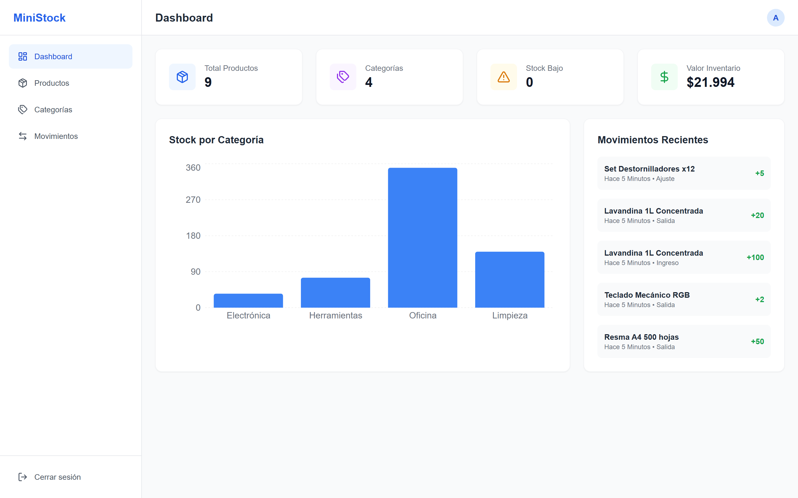
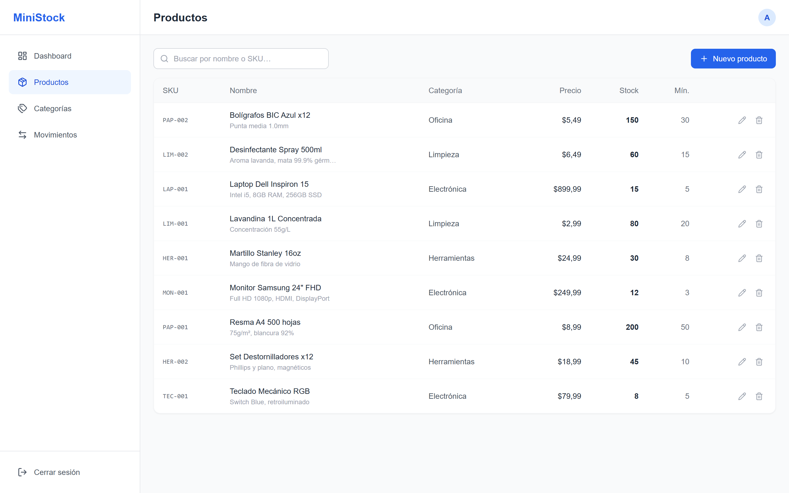
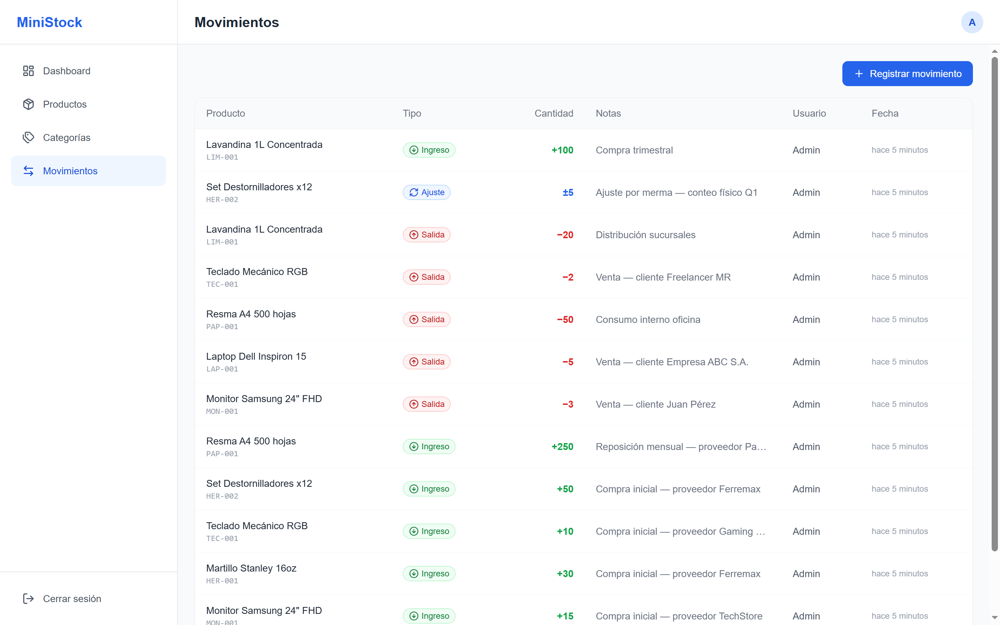

# MiniStock — Sistema de Gestión de Inventario

**Demo en vivo:** https://web-ochre-zeta-22.vercel.app &nbsp;·&nbsp; **API Swagger:** http://204.168.134.159:5010/swagger

> Sistema fullstack de inventario con autenticación JWT, CRUD completo y dashboard de métricas en tiempo real. Desarrollado como proyecto de portfolio para demostrar arquitectura production-ready en .NET 8 + Next.js 14.

[](https://dotnet.microsoft.com)
[](https://nextjs.org)
[](https://www.postgresql.org)
[](https://www.docker.com)
[](api/MiniStock.Tests/)
[](api/MiniStock.Tests/)

---

## Screenshots

| Dashboard | Productos | Movimientos |
|:---------:|:---------:|:-----------:|
|  |  |  |

**Credenciales demo:** `admin@ministock.com` / `Admin123!`

---

## Índice

1. [Arquitectura general](#1-arquitectura-general)
2. [Proyecto Backend — `api/`](#2-proyecto-backend--api)
3. [Proyecto Frontend — `web/`](#3-proyecto-frontend--web)
4. [Pipeline CI/CD — `.github/` + `deploy/`](#4-pipeline-cicd--github--deploy)
5. [Patrones y decisiones de diseño](#5-patrones-y-decisiones-de-diseño)
6. [Estándares y buenas prácticas](#6-estándares-y-buenas-prácticas)
7. [Tests](#7-tests)
8. [Seguridad](#8-seguridad)
9. [Setup local](#9-setup-local)
10. [Endpoints de la API](#10-endpoints-de-la-api)

---

## 1. Arquitectura general

```
┌─────────────────────────────────────────────────────────┐
│  Browser (HTTPS)                                        │
│  Next.js — Vercel                                       │
│  ┌──────────────────────────────────────────────────┐  │
│  │  /api/v1/[...path]  ←── Proxy Route Handler      │  │
│  │  (server-side, Node.js)                          │  │
│  └──────────────────┬───────────────────────────────┘  │
└─────────────────────┼───────────────────────────────────┘
                      │ HTTP (server-to-server, sin CORS)
┌─────────────────────▼───────────────────────────────────┐
│  .NET 8 API — Hetzner :5010                             │
│  Docker Container                                       │
│  ┌──────────────────────────────────────────────────┐  │
│  │  ASP.NET Core Web API                            │  │
│  │  Clean Architecture (4 capas)                    │  │
│  └──────────────────┬───────────────────────────────┘  │
└─────────────────────┼───────────────────────────────────┘
                      │
┌─────────────────────▼───────────────────────────────────┐
│  PostgreSQL 16 — Docker Container                       │
└─────────────────────────────────────────────────────────┘
```

**Por qué este diseño:**
- El frontend necesita ser HTTPS (Vercel lo provee gratis). La API en Hetzner es HTTP porque no tiene dominio asignado aún. El browser bloquearía llamadas HTTPS → HTTP (*mixed-content*). El proxy Route Handler resuelve esto haciendo la llamada HTTP desde el servidor de Vercel, invisible para el browser.
- Separar frontend y backend en hosts distintos permite escalarlos independientemente y usar la plataforma óptima para cada uno (Vercel para CDN global, VPS para la API con acceso a BD).

---

## 2. Proyecto Backend — `api/`

### Clean Architecture

La API está organizada en cuatro proyectos según el principio de **dependencia hacia adentro**: las capas externas dependen de las internas, nunca al revés.

```
MiniStock.Domain          (núcleo — sin dependencias)
       ▲
MiniStock.Application     (casos de uso — depende solo de Domain)
       ▲
MiniStock.Infrastructure  (implementación — depende de Application + EF Core)
       ▲
MiniStock.Api             (presentación — depende de todas)
```

**Por qué Clean Architecture en lugar de una arquitectura en capas tradicional (3-tier):**

En una arquitectura 3-tier clásica, la lógica de negocio conoce la BD (accede al ORM directamente). Aquí, la capa de Application solo conoce *interfaces* de repositorio (`IProductRepository`, etc.). La implementación real (EF Core + PostgreSQL) vive en Infrastructure y se inyecta en runtime. Esto permite:

1. **Testear servicios sin BD**: se puede mockear `IProductRepository` en tests unitarios sin levantar PostgreSQL.
2. **Cambiar ORM o BD sin tocar la lógica de negocio**: si mañana se migra a MongoDB, solo cambia Infrastructure.
3. **Lógica de negocio portable**: el proyecto Application no referencia `Microsoft.AspNetCore` — podría usarse en una app de consola, worker, o Blazor sin cambios.

---

### Capa Domain

Contiene las entidades del negocio con sus invariantes encapsuladas.

**Entidades principales:**

| Entidad | Responsabilidad clave |
|---------|----------------------|
| `BaseEntity` | Id (Guid), CreatedAt/UpdatedAt UTC — base de todas las entidades |
| `Product` | Producto del inventario. Stock solo modificable vía `ApplyStockMovement()` |
| `Category` | Agrupación de productos. Soft delete con `IsActive` |
| `StockMovement` | Registro inmutable de un cambio de stock. Delta + tipo + usuario |
| `User` | Usuario del sistema. Gestiona su propio refresh token |
| `Role` | Rol de autorización (Admin / User) |

**Principios aplicados en las entidades:**

- **Setters privados**: ningún código externo puede mutar `product.Stock = 5`. Solo los métodos de la entidad pueden hacerlo. Esto garantiza que las reglas de negocio (ej. "no stock negativo") no puedan ser salteadas.
- **Constructor privado + factory method**: `Product.Create(...)` es el único camino para instanciar un producto. El constructor privado previene `new Product()` con propiedades sin inicializar.
- **Propiedades calculadas**: `IsLowStock` se computa en memoria, no persiste en BD. Si cambia la regla del umbral, cambia en un solo lugar.

---

### Capa Application

Contiene los casos de uso de la aplicación. Cada servicio coordina repositorios para resolver un flujo de negocio.

**Servicios:**

| Servicio | Caso de uso principal |
|----------|-----------------------|
| `AuthService` | Register, Login, Refresh, Logout con JWT + refresh tokens |
| `ProductService` | CRUD completo con validación de SKU único y categoría válida |
| `CategoryService` | CRUD con validación de nombre único |
| `StockMovementService` | Registrar movimientos con validación de stock no negativo |
| `DashboardService` | Agregaciones para los KPIs del dashboard |

**Patrón Result\<T\>:**

Los servicios no lanzan excepciones para errores de negocio. Retornan `Result<T>`:

```csharp
// En el servicio
if (await _products.ExistsBySkuAsync(request.SKU, ct))
    return Result.Failure<ProductResponse>("Ya existe un producto con ese SKU.");

// En el controller
var result = await _service.CreateAsync(request);
if (result.IsFailure) return Conflict(result.Error);
return CreatedAtAction(..., result.Value);
```

**Por qué Result en lugar de excepciones:** Las excepciones están semánticamente reservadas para situaciones inesperadas (bugs, fallos de red). "El SKU ya existe" es un flujo esperado. Con Result, el compilador *fuerza* al caller a verificar si la operación fue exitosa antes de usar el valor — es imposible olvidarse de manejar el error.

**Validadores (FluentValidation):**

Cada request tiene su validador. Se ejecutan antes de llegar al servicio, vía pipeline de ASP.NET Core:

```
Request → FluentValidation → Controller → Service → Repository
```

Si la validación falla, la API retorna `400 Bad Request` con los errores detallados por campo, sin que el servicio se ejecute. La regla de validación más compleja es la del movimiento:

```csharp
// Quantity > 0 para Entry/Exit, != 0 para Adjustment (puede ser negativo)
RuleFor(x => x.Quantity)
    .GreaterThan(0).When(x => x.Type != MovementType.Adjustment)
    .NotEqual(0).When(x => x.Type == MovementType.Adjustment);
```

---

### Capa Infrastructure

Implementa las interfaces definidas en Application.

**AppDbContext + Unit of Work:**

`AppDbContext` implementa `IUnitOfWork` directamente. EF Core ya es una unidad de trabajo: acumula cambios en memoria y los persiste todos juntos en un único `SaveChangesAsync`. Crear una clase `UnitOfWork` separada que envuelva el DbContext sería duplicar responsabilidad sin agregar valor.

**Configuraciones Fluent API (no DataAnnotations):**

Cada entidad tiene su `IEntityTypeConfiguration<T>`. Se eligió Fluent API sobre DataAnnotations porque:
- Mantiene las entidades de dominio limpias de atributos de infraestructura.
- Permite configuraciones más complejas (índices únicos, precisión decimal, conversores de enum a string).
- `ApplyConfigurationsFromAssembly` las registra todas automáticamente — agregar una nueva entidad no requiere modificar el contexto.

**Repositorios:**

| Repositorio | Característica notable |
|-------------|------------------------|
| `ProductRepository` | Búsqueda con `ILike` (case-insensitive, específico de PostgreSQL/Npgsql) |
| `StockMovementRepository` | Siempre ordenado por `CreatedAt desc` — historial cronológico inverso |
| `DashboardRepository` | Consultas de agregación (`COUNT`, `SUM`) directas en SQL vía LINQ |

**JwtService:**

- Access token: JWT firmado con HMAC-SHA256, duración configurable (default 60 min).
- Refresh token: 64 bytes del CSPRNG del SO (`RandomNumberGenerator`), no `Random` ni `Guid` (predecibles).
- Claims incluidos: `sub` (userId), `email`, `name`, `role`, `jti` (ID único del token para futura blocklist).

---

### Capa Api (Controllers)

Los controllers son deliberadamente delgados: solo toman el resultado del servicio y lo mapean a una respuesta HTTP apropiada.

```csharp
[HttpPost]
public async Task<IActionResult> Create([FromBody] CreateProductRequest request)
{
    var result = await _service.CreateAsync(request);
    if (result.IsFailure) return Conflict(result.Error);
    return CreatedAtAction(nameof(GetById), new { id = result.Value!.Id }, result.Value);
}
```

**Extracción del userId desde el JWT** (no desde el body):

```csharp
// En StockMovementsController — el usuario no puede falsificar su propio ID
var userId = Guid.Parse(User.FindFirstValue(ClaimTypes.NameIdentifier)!);
```

---

## 3. Proyecto Frontend — `web/`

### Next.js 14 App Router

Se usa el **App Router** (introducido en Next.js 13, estable en 14) en lugar del Pages Router porque:
- Soporta React Server Components de forma nativa.
- Los route groups `(app)/` permiten anidar layouts sin que el nombre del grupo aparezca en la URL.
- Los Route Handlers (reemplazo de API Routes) son más flexibles para el proxy.

**Estructura de rutas:**

```
app/
├── layout.tsx          → Root layout (solo QueryProvider, sin sidebar)
├── login/
│   └── page.tsx        → Página pública, sin auth guard
└── (app)/              → Route group — comparten el layout con sidebar
    ├── layout.tsx      → Aplica LayoutShell (sidebar + auth guard)
    ├── page.tsx        → Dashboard /
    ├── productos/
    │   └── page.tsx    → CRUD productos /productos
    ├── categorias/
    │   └── page.tsx    → CRUD categorías /categorias
    └── movimientos/
        └── page.tsx    → Historial de movimientos /movimientos
```

**Por qué el route group `(app)/`:**
Sin él, el layout con sidebar se aplicaría también a `/login`, lo que obligaría a condicionarlo con lógica adicional. El grupo separa limpiamente las rutas públicas (login) de las protegidas (todo lo demás) sin duplicar código.

**Auth guard en el cliente:**

```tsx
// layout-shell.tsx
useEffect(() => {
  if (!isAuthenticated()) router.replace("/login");
}, [router]);
```

Se hace en el cliente (no en middleware de Next.js) como solución pragmática para este portfolio. Para producción, el approach correcto es `middleware.ts` server-side para evitar el flash de contenido protegido.

---

### Tanstack Query (React Query)

Toda la comunicación con la API se gestiona con Tanstack Query v5, no con `useEffect` + `useState`. Las razones:

| Sin React Query | Con React Query |
|-----------------|-----------------|
| `useState` para loading, error, data | Un solo `useQuery` |
| `useEffect` para disparar el fetch | Automático, se re-ejecuta al cambiar la queryKey |
| Caché manual | Caché automática con invalidación selectiva |
| Refetch manual después de mutaciones | `invalidateQueries` recarga solo lo necesario |
| Sin deduplicación | Requests iguales simultáneos se deduplicen |

**Invalidación de caché en cascada:**

Registrar un movimiento de stock invalida tres cachés porque un movimiento afecta tres partes de la UI:

```ts
onSuccess: () => {
  qc.invalidateQueries({ queryKey: ["movements"] });  // nuevo registro en la tabla
  qc.invalidateQueries({ queryKey: ["products"] });   // stock del producto cambió
  qc.invalidateQueries({ queryKey: ["dashboard"] });  // KPIs pueden cambiar
},
```

**Hooks como abstracción:**

Los componentes de página nunca llaman a `api.get(...)` directamente. Consumen hooks (`useProducts`, `useMovements`, etc.) que encapsulan queryKey, queryFn y tipos. Si la URL de un endpoint cambia, se edita en un solo lugar.

---

### Proxy Route Handler

```
Browser → /api/v1/products → Vercel → http://204.168.134.159:5010/api/v1/products
```

El archivo `app/api/v1/[...path]/route.ts` intercepta cualquier request que comience con `/api/v1/` y lo reenvía al backend. Los headers `hop-by-hop` (`host`, `connection`, `transfer-encoding`, `content-length`, `expect`) se excluyen porque:

- `host`: el backend rechazaría el host de Vercel.
- `expect`: Kestrel (.NET) no implementa `100 Continue`. Este header lo agrega Node.js automáticamente en POSTs con body y causaba `TypeError: fetch failed` en todos los POSTs hasta identificarlo.

---

## 4. Pipeline CI/CD — `.github/` + `deploy/`

### GitHub Actions (`deploy.yml`)

```
push a main
    → dotnet build -c Release (validación)
    → SSH al servidor Hetzner
        → git pull origin main
        → docker compose up --build -d
        → docker image prune -f
```

**Por qué `--build` en cada deploy:** garantiza que el nuevo código siempre se compile en una imagen fresca. Sin `--build`, Docker reutilizaría la imagen cacheada aunque el código haya cambiado.

**Secrets de GitHub Actions:**
- `HETZNER_SSH_KEY`: clave privada RSA. Nunca hardcodeada — vive en GitHub Secrets y solo existe en el agente de CI durante el job.

### Dockerfile (multi-stage build)

```dockerfile
# Stage 1: compilar
FROM mcr.microsoft.com/dotnet/sdk:8.0 AS build
# ... restore + publish

# Stage 2: imagen de runtime (sin SDK)
FROM mcr.microsoft.com/dotnet/aspnet:8.0 AS runtime
COPY --from=build /app/publish .
```

**Por qué multi-stage:** la imagen de SDK de .NET pesa ~900 MB. La imagen de runtime (ASP.NET) pesa ~220 MB. Sin multi-stage, la imagen final incluiría el SDK completo, compiladores y herramientas de desarrollo que no se necesitan en producción. El multi-stage descarta todo eso y solo copia los binarios compilados.

### docker-compose.yml

```yaml
services:
  db:
    image: postgres:16-alpine
    healthcheck: pg_isready -U ministock  # ← clave

  api:
    depends_on:
      db:
        condition: service_healthy         # ← espera que la BD esté lista
```

**Por qué `service_healthy` en lugar de `service_started`:** `service_started` solo espera que el contenedor arranque, no que PostgreSQL esté listo para aceptar conexiones. Sin el healthcheck, la API intentaría conectarse a la BD antes de que PostgreSQL termine de inicializarse y fallaría con `Connection refused`.

### Auto-migración al startup

```csharp
using var scope = app.Services.CreateScope();
var db = scope.ServiceProvider.GetRequiredService<AppDbContext>();
await db.Database.MigrateAsync();          // Aplica migraciones pendientes
await DatabaseSeeder.SeedAsync(db);        // Inserta datos demo si la BD está vacía
```

**Por qué migrar en startup y no en el pipeline:** simplifica el deploy. No hay paso separado de migración que pueda quedar fuera de sincronía con el código. La migración es idempotente (EF Core registra las ya aplicadas en `__EFMigrationsHistory`).

---

## 5. Patrones y decisiones de diseño

### Result\<T\> — manejo de errores de negocio

**Problema:** las excepciones tienen overhead de stack trace y semánticamente representan situaciones *inesperadas*. "El SKU ya existe" es un flujo esperado.

**Solución:** `Result<T>` y `Result` retornan el éxito o el error de forma explícita. El compilador fuerza al caller a verificar `IsSuccess` antes de usar `Value`.

```csharp
// El caller no puede ignorar el error — IsFailure es explícito
var result = await _productService.CreateAsync(request);
if (result.IsFailure) return Conflict(result.Error);
return Created(result.Value);
```

### Repository + Unit of Work

**Problema:** si los servicios usaran `DbContext` directamente, estarían acoplados a EF Core, dificultando los tests y un posible cambio de ORM.

**Solución:** los repositorios encapsulan las queries. Los servicios solo conocen la interfaz (`IProductRepository`). El Unit of Work (`IUnitOfWork.SaveChangesAsync`) agrupa múltiples operaciones de repositorio en una sola transacción.

```csharp
// Atómico: movimiento + actualización de stock en un solo SaveChanges
await _movements.AddAsync(movement, ct);
_products.Update(product);
await _uow.SaveChangesAsync(ct);
```

### Factory Method en entidades de dominio

**Problema:** `new Product()` con object initializer permite crear productos en estados inválidos (sin nombre, sin SKU, stock negativo).

**Solución:** constructor privado + método estático `Create(...)` con parámetros requeridos. El único camino para instanciar un producto es a través del factory method.

### Soft Delete

**Problema:** eliminar físicamente un producto rompería la integridad referencial con los movimientos de stock históricos.

**Solución:** `Deactivate()` marca `IsActive = false`. Los repositorios filtran `IsActive == true` en las queries de listado. El historial queda intacto.

### Encapsulación de colecciones

```csharp
private readonly List<StockMovement> _movements = [];
public IReadOnlyCollection<StockMovement> Movements => _movements.AsReadOnly();
```

El código externo puede leer la colección pero no puede llamar `product.Movements.Add(...)` y saltarse la lógica de negocio. Solo `ApplyStockMovement` puede modificar el stock.

---

## 6. Estándares y buenas prácticas

### Conventional Commits

Todos los commits siguen el formato `tipo(scope): descripción`:

```
feat(api): add stock movement endpoint
fix(web): exclude Expect header in proxy to prevent Kestrel rejection
docs: rewrite README with architecture and design decisions
chore(deploy): add .dockerignore to reduce build context
```

Forzado mediante un hook de Git en `.githooks/commit-msg`. Facilita la generación de changelogs automáticos y hace el historial legible para cualquier colaborador.

### Validación en dos capas

1. **Frontend**: validación visual básica (campos requeridos, tipos). Feedback inmediato al usuario.
2. **Backend (FluentValidation)**: validación real que garantiza integridad. No se confía en la validación del cliente.

### Secretos nunca en el código

```yaml
# docker-compose.yml
environment:
  Jwt__Key: ${JWT_KEY}          # Variable de entorno del host
  DB_PASSWORD: ${DB_PASSWORD}   # No hardcodeada
```

Las claves reales viven en: GitHub Secrets (CI/CD), Vercel Environment Variables (frontend), y archivo `.env` en el servidor (gitignoreado). El hook `check-secrets.ps1` bloquea commits con secrets hardcodeados.

### Logging estructurado (Serilog)

```csharp
builder.Host.UseSerilog((ctx, services, config) => config
    .ReadFrom.Configuration(ctx.Configuration)
    .Enrich.FromLogContext()
    .WriteTo.Console());
```

Cada request queda logueado automáticamente con `UseSerilogRequestLogging()`. En producción, los logs pueden redirigirse a cualquier sink (Elasticsearch, Azure Monitor) sin cambiar el código.

### FluentValidation — mensajes en español

Todos los mensajes de error de validación están en español para coherencia con el dominio del negocio.

### CORS restrictivo en producción

```csharp
policy.WithOrigins(allowedOrigins)  // Solo Vercel, no "*"
      .AllowAnyHeader()
      .AllowAnyMethod()
```

---

## 7. Tests

El proyecto `api/MiniStock.Tests` contiene **102 tests unitarios** con **83.6 % de cobertura de líneas** (meta: 80 %).

| Capa | Cobertura |
|------|-----------|
| Domain | 100 % |
| Application | 81 % |
| Infrastructure (JwtService) | 74.5 % |

**Stack de testing:** xUnit + Moq + FluentAssertions + coverlet.

Los repositorios de EF Core (Infrastructure.Persistence) se excluyen del coverage porque requieren integración contra una BD real — no tiene sentido mockear EF Core ya que eso no probaría nada útil. Lo que se testa unitariamente son los servicios (lógica de negocio), validadores, el patrón Result\<T\> y JwtService.

**Técnica para navegar propiedades privadas en tests:**

Las entidades tienen propiedades de navegación con setters privados (ej. `Product.Category`). Para setearlas en tests sin romper el encapsulamiento del dominio se usa reflexión:

```csharp
typeof(Product).GetProperty(nameof(Product.Category))!.SetValue(product, category);
```

Esto evita agregar setters públicos o constructores solo para tests.

**Correr los tests:**

```bash
dotnet test MiniStock.sln --collect:"XPlat Code Coverage"
```

---

## 8. Seguridad

Vulnerabilidades identificadas y estado de mitigación:

| Vulnerabilidad | Severidad | Estado |
|---|---|---|
| Brute force en `/auth/login` y `/auth/register` | Alta | ✅ Mitigado |
| JWT key sin longitud mínima validada | Media | ✅ Mitigado |
| Comparación frágil de strings en controllers | Baja | ✅ Mitigado |
| Sin security headers HTTP en el frontend | Media | ✅ Mitigado |
| JWT en localStorage (vulnerable a XSS) | Media | ⚠️ Aceptado — documentado en `auth.ts` |
| Access token válido 60 min post-logout | Media | ⚠️ Trade-off inherente de JWT stateless |

**Mitigaciones implementadas:**

**Rate limiting (.NET 8 built-in):** los endpoints `/auth/login` y `/auth/register` aceptan máximo 10 requests por minuto por IP. Superar el límite retorna `HTTP 429 Too Many Requests`. No requiere dependencia externa — usa `Microsoft.AspNetCore.RateLimiting`.

**Validación de JWT key en startup:** `JwtService` valida que la clave tenga al menos 32 caracteres (256 bits). Si la clave es corta, la app falla al arrancar con un mensaje descriptivo en lugar de generar tokens débiles silenciosamente.

**`Result.IsNotFound` — routing de errores robusto:** los controllers ya no hacen `result.Error.Contains("no encontrad")` para decidir si devolver 404 o 409. Los servicios marcan `notFound: true` al crear fallos de "recurso no encontrado", y los controllers usan `result.IsNotFound`. Cambiar un mensaje de error ya no rompe el routing HTTP silenciosamente.

**Security headers en Next.js (`next.config.mjs`):** aplicados en todas las rutas:
- `X-Frame-Options: DENY` — previene clickjacking
- `X-Content-Type-Options: nosniff` — previene MIME sniffing
- `Content-Security-Policy` — restringe fuentes de scripts, estilos e imágenes a `'self'`
- `Referrer-Policy: strict-origin-when-cross-origin`
- `Permissions-Policy` — deshabilita acceso a cámara, micrófono y geolocalización

---

## 9. Setup local

### Requisitos

- [.NET 8 SDK](https://dotnet.microsoft.com/download)
- [Node.js 18+](https://nodejs.org)
- [Docker Desktop](https://www.docker.com)

### Backend

```bash
# 1. PostgreSQL local
docker run -d --name ministock-db \
  -e POSTGRES_DB=ministock -e POSTGRES_USER=ministock \
  -e POSTGRES_PASSWORD=localpass -p 5432:5432 postgres:16-alpine

# 2. Secrets (no commitear)
cd api/MiniStock.Api
dotnet user-secrets set "ConnectionStrings:DefaultConnection" \
  "Host=localhost;Port=5432;Database=ministock;Username=ministock;Password=localpass"
dotnet user-secrets set "Jwt:Key"      "clave-secreta-de-al-menos-32-caracteres"
dotnet user-secrets set "Jwt:Issuer"   "ministock-api"
dotnet user-secrets set "Jwt:Audience" "ministock-web"

# 3. Correr — migra y seedea automáticamente
dotnet run --project api/MiniStock.Api
# API en http://localhost:5197 · Swagger en http://localhost:5197/swagger
```

### Frontend

```bash
cd web
echo 'NEXT_PUBLIC_API_URL=http://localhost:5197/api/v1' > .env.local
npm install && npm run dev
# App en http://localhost:3000
```

---

## 10. Endpoints de la API

Todos requieren `Authorization: Bearer <token>` excepto `/auth/*`.

### Auth `POST /api/v1/auth`

| Método | Ruta        | Body | Respuesta |
|--------|-------------|------|-----------|
| POST | `/register` | `{ name, email, password }` | `201` AuthResponse \| `429` |
| POST | `/login`    | `{ email, password }` | `200` AuthResponse \| `429` |
| POST | `/refresh`  | `{ refreshToken }` | `200` AuthResponse |
| POST | `/logout`   | — | `204` |

### Products `/api/v1/products`

| Método | Ruta    | Query / Body | Respuesta |
|--------|---------|-------------|-----------|
| GET    | `/`     | `?page&pageSize&search&categoryId` | `200` PagedResult |
| GET    | `/{id}` | — | `200` ProductResponse \| `404` |
| POST   | `/`     | CreateProductRequest | `201` \| `400` \| `409` |
| PUT    | `/{id}` | UpdateProductRequest | `200` \| `404` \| `409` |
| DELETE | `/{id}` | — | `204` \| `404` |

### Categories `/api/v1/categories`

| Método | Ruta    | Respuesta |
|--------|---------|-----------|
| GET    | `/`     | `200` PagedResult |
| GET    | `/all`  | `200` List (para dropdowns, sin paginación) |
| GET    | `/{id}` | `200` \| `404` |
| POST   | `/`     | `201` \| `409` |
| PUT    | `/{id}` | `200` \| `404` \| `409` |
| DELETE | `/{id}` | `204` \| `404` |

### Stock Movements `/api/v1/stock-movements`

| Método | Ruta | Respuesta |
|--------|------|-----------|
| POST   | `/`  | `201` StockMovementResponse \| `400` \| `404` |
| GET    | `/`  | `200` PagedResult — `?page&pageSize&productId` |

### Dashboard `/api/v1/dashboard`

| Método | Ruta                 | Respuesta |
|--------|----------------------|-----------|
| GET    | `/summary`           | `200` DashboardSummaryResponse |
| GET    | `/stock-by-category` | `200` List |
| GET    | `/low-stock`         | `200` List |
| GET    | `/recent-movements`  | `200` List — `?count=10` |

---

## Autor

**Marcos Ríos** — Desarrollador Fullstack .NET / Next.js  
[Portfolio](https://portfolio-web-drab-ten.vercel.app/) · [LinkedIn](https://www.linkedin.com/in/marcos-sebasti%C3%A1n-r%C3%ADos-359b717/) · [GitHub](https://github.com/tech-marcos-rios)
