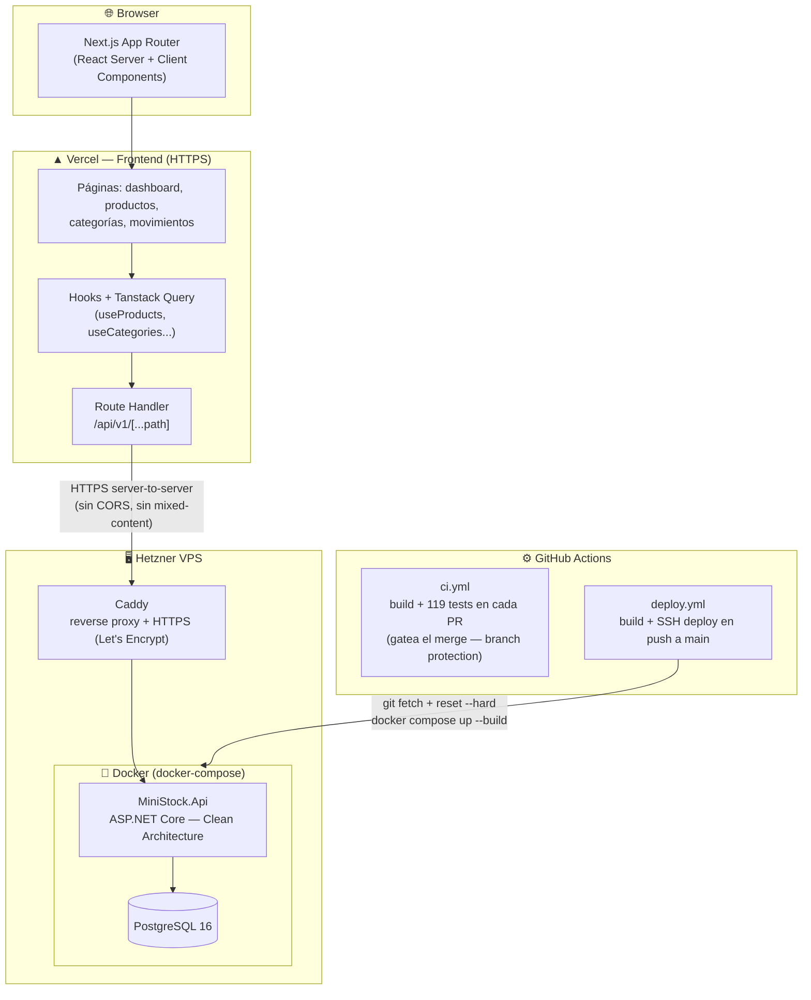
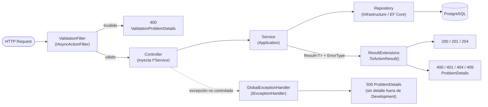

# MiniStock — Sistema de Gestión de Inventario

**Demo en vivo:** https://ministock.marcosrios.dev &nbsp;·&nbsp; **API:** https://api.ministock.marcosrios.dev

> Sistema fullstack de inventario con autenticación JWT, CRUD completo y dashboard de métricas en tiempo real. Desarrollado como proyecto de portfolio para demostrar arquitectura production-ready en .NET 8 + Next.js 14.

[](https://dotnet.microsoft.com)
[](https://nextjs.org)
[](https://www.postgresql.org)
[](https://www.docker.com)
[](api/MiniStock.Tests/)
[-85%25-brightgreen)](api/MiniStock.Tests/)

---

## Screenshots

| Dashboard | Productos | Movimientos |
|:---------:|:---------:|:-----------:|
|  |  |  |

Registrate con tu propio usuario desde la demo para probarlo — el registro es libre y no requiere aprobación.

---

## Índice

1. [Arquitectura general](#1-arquitectura-general)
2. [Proyecto Backend — `api/`](#2-proyecto-backend--api)
3. [Proyecto Frontend — `web/`](#3-proyecto-frontend--web)
4. [Pipeline CI/CD — `.github/` + `deploy/`](#4-pipeline-cicd--github--deploy)
5. [Patrones y decisiones de diseño](#5-patrones-y-decisiones-de-diseño)
6. [Estándares y buenas prácticas](#6-estándares-y-buenas-prácticas)
7. [Tests y verificación](#7-tests-y-verificación)
8. [Seguridad](#8-seguridad)
9. [Setup local](#9-setup-local)
10. [Endpoints de la API](#10-endpoints-de-la-api)

---

## 1. Arquitectura general

### Diagrama de componentes



**Por qué este diseño:**
- El proxy Route Handler nació para resolver *mixed-content*: durante la primera etapa, la API vivía sin dominio propio en `IP:5010` (HTTP), y el browser bloquea llamadas HTTPS → HTTP. Hoy la API tiene su propio subdominio con HTTPS vía Caddy, pero el proxy se mantiene porque simplifica el cliente (mismo origen, sin configurar CORS por endpoint) y oculta el origen real del backend.
- Separar frontend y backend en hosts distintos permite escalarlos independientemente y usar la plataforma óptima para cada uno (Vercel para CDN global, VPS para la API con acceso a BD).
- El deploy es *pull-based*: GitHub Actions no empuja artefactos, le pide por SSH al server que se traiga el código y se reconstruya. Es más simple que manejar credenciales de registry de imágenes, pero tiene una trampa que ya mordió a este repo — ver el "Por qué" de `git fetch + reset --hard` en la [sección 4](#4-pipeline-cicd--github--deploy).

---

## 2. Proyecto Backend — `api/`

### Clean Architecture

La API está organizada en cuatro proyectos según el principio de **dependencia hacia adentro**: las capas externas dependen de las internas, nunca al revés.

```
MiniStock.Domain          (núcleo — sin dependencias)
       ▲
MiniStock.Application     (casos de uso — depende solo de Domain)
       ▲
MiniStock.Infrastructure  (implementación — depende de Application + EF Core)
       ▲
MiniStock.Api             (presentación — depende de todas)
```

**Por qué Clean Architecture en lugar de una arquitectura en capas tradicional (3-tier):**

En una arquitectura 3-tier clásica, la lógica de negocio conoce la BD (accede al ORM directamente). Aquí, la capa de Application solo conoce *interfaces* de repositorio (`IProductRepository`, etc.). La implementación real (EF Core + PostgreSQL) vive en Infrastructure y se inyecta en runtime. Esto permite:

1. **Testear servicios sin BD**: se puede mockear `IProductRepository` en tests unitarios sin levantar PostgreSQL.
2. **Cambiar ORM o BD sin tocar la lógica de negocio**: si mañana se migra a MongoDB, solo cambia Infrastructure.
3. **Lógica de negocio portable**: el proyecto Application no referencia `Microsoft.AspNetCore` — podría usarse en una app de consola, worker, o Blazor sin cambios.

---

### Capa Domain

Contiene las entidades del negocio con sus invariantes encapsuladas.

**Entidades principales:**

| Entidad | Responsabilidad clave |
|---------|----------------------|
| `BaseEntity` | Id (Guid), CreatedAt/UpdatedAt UTC — base de todas las entidades |
| `Product` | Producto del inventario. Stock solo modificable vía `ApplyStockMovement()` |
| `Category` | Agrupación de productos. Soft delete con `IsActive` |
| `StockMovement` | Registro inmutable de un cambio de stock. Delta + tipo + usuario |
| `User` | Usuario del sistema. Gestiona su propio refresh token |
| `Role` | Rol de autorización (Admin / User) |

**Principios aplicados en las entidades:**

- **Setters privados**: ningún código externo puede mutar `product.Stock = 5`. Solo los métodos de la entidad pueden hacerlo. Esto garantiza que las reglas de negocio (ej. "no stock negativo") no puedan ser salteadas.
- **Constructor privado + factory method**: `Product.Create(...)` es el único camino para instanciar un producto. El constructor privado previene `new Product()` con propiedades sin inicializar.
- **Propiedades calculadas**: `IsLowStock` se computa en memoria, no persiste en BD. Si cambia la regla del umbral, cambia en un solo lugar.

---

### Capa Application

Contiene los casos de uso de la aplicación. Cada servicio coordina repositorios para resolver un flujo de negocio.

**Servicios (detrás de interfaz — DIP):**

| Servicio | Interfaz | Caso de uso principal |
|----------|----------|-----------------------|
| `AuthService` | `IAuthService` | Register, Login, Refresh, Logout con JWT + refresh tokens |
| `ProductService` | `IProductService` | CRUD completo con validación de SKU único y categoría válida |
| `CategoryService` | `ICategoryService` | CRUD con validación de nombre único |
| `StockMovementService` | `IStockMovementService` | Registrar movimientos con validación de stock no negativo |
| `DashboardService` | `IDashboardService` | Agregaciones para los KPIs del dashboard |

**Por qué interfaz para cada servicio:** los controllers inyectan `IProductService`, no `ProductService`. Sin la interfaz, la capa Api quedaría acoplada a la implementación concreta (Dependency Inversion Principle roto) y reemplazar/decorar un servicio (por ejemplo con caching o logging vía decorator) exigiría tocar el controller. Con la interfaz, ese cambio es solo una línea en el registro de DI.

**Patrón Result\<T\> + ErrorType:**

Los servicios no lanzan excepciones para errores de negocio. Retornan `Result<T>`, y cada fallo lleva un `ErrorType` explícito:

```csharp
// En el servicio
if (await _products.ExistsBySkuAsync(request.SKU, ct))
    return Result.Failure<ProductResponse>("Ya existe un producto con ese SKU.", ErrorType.Conflict);

var category = await _categories.GetByIdAsync(request.CategoryId, ct);
if (category is null)
    return Result.Failure<ProductResponse>("Categoría no encontrada.", ErrorType.NotFound);

// En el controller — un solo lugar mapea ErrorType a status code (ver ResultExtensions más abajo)
var result = await _service.CreateAsync(request, ct);
return result.ToActionResult(value => CreatedAtAction(nameof(GetById), new { id = value.Id }, value));
```

**Por qué Result en lugar de excepciones:** las excepciones están semánticamente reservadas para situaciones inesperadas (bugs, fallos de red). "El SKU ya existe" es un flujo esperado. Con Result, el compilador *fuerza* al caller a verificar si la operación fue exitosa antes de usar el valor — es imposible olvidarse de manejar el error.

**Por qué `ErrorType` y no un `bool IsNotFound`:** la primera versión de `Result` solo tenía un booleano para distinguir "no encontrado" del resto. Como no todos los `Result.Failure(...)` lo seteaban, un controller (`CategoriesController.Update`) terminó decidiendo el status code parseando el string del error (`result.Error.Contains("no encontrad")`) — funcionaba, pero se rompía en silencio si alguien cambiaba el wording del mensaje. `ErrorType` (`Validation` / `NotFound` / `Conflict` / `Unauthorized`) reemplaza ese booleano y el mapeo a status code vive en un solo lugar (`ResultExtensions.ToActionResult`, capa Api), no repetido/adivinado en cada controller.

**Validadores (FluentValidation) — y el bug que motivó documentarlo así:**

Cada request tiene su `AbstractValidator<T>` en `Application/Validators/`, registrado con `AddValidatorsFromAssembly`. Eso *registra* los validators en el contenedor de DI — pero registrarlos no alcanza para que se ejecuten. Durante una revisión de buenas prácticas se encontró que ningún componente los invocaba: la API aceptaba nombre vacío, precio negativo o SKU vacío sin rechazar nada.

El fix es `ValidationFilter` (`Api/Filters/ValidationFilter.cs`), un `IAsyncActionFilter` registrado globalmente que, por cada argumento de la acción, resuelve su `IValidator<T>` (si existe) y corta la ejecución con `400 ValidationProblemDetails` antes de que el controller la reciba:

```
Request → ValidationFilter (resuelve IValidator<T> y corta si falla) → Controller → Service → Repository
```

La regla de validación más compleja es la del movimiento de stock:

```csharp
// Quantity > 0 para Entry/Exit, != 0 para Adjustment (puede ser negativo)
RuleFor(x => x.Quantity)
    .GreaterThan(0).When(x => x.Type != MovementType.Adjustment)
    .NotEqual(0).When(x => x.Type == MovementType.Adjustment);
```

**Manejo global de excepciones no controladas:**

Errores de negocio (`Result.Failure`) y errores de validación (`ValidationFilter`) cubren los flujos esperados. Para lo inesperado — un bug, una excepción de infraestructura — `GlobalExceptionHandler` (`Api/GlobalExceptionHandler.cs`) implementa `IExceptionHandler` (nativo de .NET 8, registrado con `AddExceptionHandler` + `app.UseExceptionHandler()`) y devuelve un `ProblemDetails` 500. El detalle de la excepción (mensaje + stack trace) solo se incluye en `Development` — en producción el body es genérico para no filtrar información interna.

---

### Capa Infrastructure

Implementa las interfaces definidas en Application.

**AppDbContext + Unit of Work:**

`AppDbContext` implementa `IUnitOfWork` directamente. EF Core ya es una unidad de trabajo: acumula cambios en memoria y los persiste todos juntos en un único `SaveChangesAsync`. Crear una clase `UnitOfWork` separada que envuelva el DbContext sería duplicar responsabilidad sin agregar valor.

**Configuraciones Fluent API (no DataAnnotations):**

Cada entidad tiene su `IEntityTypeConfiguration<T>`. Se eligió Fluent API sobre DataAnnotations porque:
- Mantiene las entidades de dominio limpias de atributos de infraestructura.
- Permite configuraciones más complejas (índices únicos, precisión decimal, conversores de enum a string).
- `ApplyConfigurationsFromAssembly` las registra todas automáticamente — agregar una nueva entidad no requiere modificar el contexto.

**Repositorios:**

| Repositorio | Característica notable |
|-------------|------------------------|
| `ProductRepository` | Búsqueda con `ILike` (case-insensitive, específico de PostgreSQL/Npgsql) |
| `StockMovementRepository` | Siempre ordenado por `CreatedAt desc` — historial cronológico inverso |
| `DashboardRepository` | Consultas de agregación (`COUNT`, `SUM`) directas en SQL vía LINQ |

**JwtService:**

- Access token: JWT firmado con HMAC-SHA256, duración configurable (default 60 min).
- Refresh token: 64 bytes del CSPRNG del SO (`RandomNumberGenerator`), no `Random` ni `Guid` (predecibles).
- Claims incluidos: `sub` (userId), `email`, `name`, `role`, `jti` (ID único del token para futura blocklist).

---

### Capa Api (Controllers)

Los controllers son deliberadamente delgados: solo toman el resultado del servicio y lo mapean a una respuesta HTTP apropiada vía `ResultExtensions` — no hay `if (result.IsFailure) return Conflict/NotFound(...)` repetido en cada acción.

```csharp
[HttpPost]
public async Task<IActionResult> Create([FromBody] CreateProductRequest request, CancellationToken ct)
{
    var result = await _productService.CreateAsync(request, ct);
    return result.ToActionResult(value => CreatedAtAction(nameof(GetById), new { id = value.Id }, value));
}
```

**Extracción del userId desde el JWT** (no desde el body):

```csharp
// En StockMovementsController — el usuario no puede falsificar su propio ID
var userId = Guid.Parse(User.FindFirstValue(ClaimTypes.NameIdentifier)!);
```

### Flujo completo de un request



---

## 3. Proyecto Frontend — `web/`

### Next.js 14 App Router

Se usa el **App Router** (introducido en Next.js 13, estable en 14) en lugar del Pages Router porque:
- Soporta React Server Components de forma nativa.
- Los route groups `(app)/` permiten anidar layouts sin que el nombre del grupo aparezca en la URL.
- Los Route Handlers (reemplazo de API Routes) son más flexibles para el proxy.

**Estructura de rutas:**

```
app/
├── layout.tsx          → Root layout (solo QueryProvider, sin sidebar)
├── login/
│   └── page.tsx        → Página pública, sin auth guard
└── (app)/              → Route group — comparten el layout con sidebar
    ├── layout.tsx      → Aplica LayoutShell (sidebar + auth guard)
    ├── page.tsx        → Dashboard /
    ├── productos/
    │   └── page.tsx    → CRUD productos /productos
    ├── categorias/
    │   └── page.tsx    → CRUD categorías /categorias
    └── movimientos/
        └── page.tsx    → Historial de movimientos /movimientos
```

**Por qué el route group `(app)/`:**
Sin él, el layout con sidebar se aplicaría también a `/login`, lo que obligaría a condicionarlo con lógica adicional. El grupo separa limpiamente las rutas públicas (login) de las protegidas (todo lo demás) sin duplicar código.

**Auth guard en el cliente:**

```tsx
// layout-shell.tsx
useEffect(() => {
  if (!isAuthenticated()) router.replace("/login");
}, [router]);
```

Se hace en el cliente (no en middleware de Next.js) como solución pragmática para este portfolio. Para producción, el approach correcto es `middleware.ts` server-side para evitar el flash de contenido protegido.

---

### Tanstack Query (React Query)

Toda la comunicación con la API se gestiona con Tanstack Query v5, no con `useEffect` + `useState`. Las razones:

| Sin React Query | Con React Query |
|-----------------|-----------------|
| `useState` para loading, error, data | Un solo `useQuery` |
| `useEffect` para disparar el fetch | Automático, se re-ejecuta al cambiar la queryKey |
| Caché manual | Caché automática con invalidación selectiva |
| Refetch manual después de mutaciones | `invalidateQueries` recarga solo lo necesario |
| Sin deduplicación | Requests iguales simultáneos se deduplicen |

**Invalidación de caché en cascada:**

Registrar un movimiento de stock invalida tres cachés porque un movimiento afecta tres partes de la UI:

```ts
onSuccess: () => {
  qc.invalidateQueries({ queryKey: ["movements"] });  // nuevo registro en la tabla
  qc.invalidateQueries({ queryKey: ["products"] });   // stock del producto cambió
  qc.invalidateQueries({ queryKey: ["dashboard"] });  // KPIs pueden cambiar
},
```

**Hooks como abstracción:**

Los componentes de página nunca llaman a `api.get(...)` directamente. Consumen hooks (`useProducts`, `useMovements`, etc.) que encapsulan queryKey, queryFn y tipos. Si la URL de un endpoint cambia, se edita en un solo lugar.

---

### Proxy Route Handler

```
Browser → /api/v1/products → Vercel → https://api.ministock.marcosrios.dev/api/v1/products
```

El archivo `app/api/v1/[...path]/route.ts` intercepta cualquier request que comience con `/api/v1/` y lo reenvía al backend. Los headers `hop-by-hop` (`host`, `connection`, `transfer-encoding`, `content-length`, `expect`) se excluyen porque:

- `host`: el backend rechazaría el host de Vercel.
- `expect`: Kestrel (.NET) no implementa `100 Continue`. Este header lo agrega Node.js automáticamente en POSTs con body y causaba `TypeError: fetch failed` en todos los POSTs hasta identificarlo.

---

## 4. Pipeline CI/CD — `.github/` + `deploy/`

### GitHub Actions (`deploy.yml`)

```
push a main
    → dotnet build -c Release (validación)
    → SSH al servidor Hetzner
        → git fetch origin main
        → git reset --hard origin/main
        → docker compose up --build -d
        → docker image prune -f
```

**Por qué `--build` en cada deploy:** garantiza que el nuevo código siempre se compile en una imagen fresca. Sin `--build`, Docker reutilizaría la imagen cacheada aunque el código haya cambiado.

**Por qué `git fetch` + `reset --hard` y no `git pull` (incidente real):** el script original hacía `git pull origin main`, que internamente es un `fetch` + `merge`. Dos veces (2026-09-04 y 2026-09-08) el checkout de `/opt/ministock` en el server divergió del historial remoto — probablemente por una interrupción a mitad de un deploy anterior — y el `merge` implícito de `pull` no supo cómo reconciliar, tirando `fatal: Need to specify how to reconcile divergent branches` y abortando el deploy sin tocar el código corriendo (falla segura, pero deploy roto). Un script de deploy *pull-based* no debería depender de que el checkout local sea "mergeable": `fetch` + `reset --hard origin/main` fuerza al server a igualar exactamente el remoto sin importar qué haya en el checkout local. Se resolvió como `hotfix/*` — ver [Git Flow](#git-flow) — y el siguiente deploy corrió verde.

**Secrets de GitHub Actions:**
- `HETZNER_SSH_KEY`: clave privada RSA. Nunca hardcodeada — vive en GitHub Secrets y solo existe en el agente de CI durante el job.

### Dockerfile (multi-stage build)

```dockerfile
# Stage 1: compilar
FROM mcr.microsoft.com/dotnet/sdk:8.0 AS build
# ... restore + publish

# Stage 2: imagen de runtime (sin SDK)
FROM mcr.microsoft.com/dotnet/aspnet:8.0 AS runtime
COPY --from=build /app/publish .
```

**Por qué multi-stage:** la imagen de SDK de .NET pesa ~900 MB. La imagen de runtime (ASP.NET) pesa ~220 MB. Sin multi-stage, la imagen final incluiría el SDK completo, compiladores y herramientas de desarrollo que no se necesitan en producción. El multi-stage descarta todo eso y solo copia los binarios compilados.

### docker-compose.yml

```yaml
services:
  db:
    image: postgres:16-alpine
    healthcheck: pg_isready -U ministock  # ← clave

  api:
    depends_on:
      db:
        condition: service_healthy         # ← espera que la BD esté lista
```

**Por qué `service_healthy` en lugar de `service_started`:** `service_started` solo espera que el contenedor arranque, no que PostgreSQL esté listo para aceptar conexiones. Sin el healthcheck, la API intentaría conectarse a la BD antes de que PostgreSQL termine de inicializarse y fallaría con `Connection refused`.

### Auto-migración al startup

```csharp
using var scope = app.Services.CreateScope();
var db = scope.ServiceProvider.GetRequiredService<AppDbContext>();
await db.Database.MigrateAsync();          // Aplica migraciones pendientes
await DatabaseSeeder.SeedAsync(db);        // Inserta datos demo si la BD está vacía
```

**Por qué migrar en startup y no en el pipeline:** simplifica el deploy. No hay paso separado de migración que pueda quedar fuera de sincronía con el código. La migración es idempotente (EF Core registra las ya aplicadas en `__EFMigrationsHistory`).

---

## 5. Patrones y decisiones de diseño

### Result\<T\> + ErrorType — manejo de errores de negocio

**Problema:** las excepciones tienen overhead de stack trace y semánticamente representan situaciones *inesperadas*. "El SKU ya existe" es un flujo esperado. Además, si cada controller decide a mano qué status code corresponde a cada fallo, ese mapeo termina duplicado (y a veces mal — ver más abajo).

**Solución:** `Result<T>` y `Result` retornan el éxito o el error de forma explícita, con un `ErrorType` (`Validation` / `NotFound` / `Conflict` / `Unauthorized`). El compilador fuerza al caller a verificar `IsSuccess` antes de usar `Value`, y `ResultExtensions.ToActionResult()` (capa Api) es el único lugar que traduce `ErrorType` a status code + `ProblemDetails`:

```csharp
// El caller no puede ignorar el error — IsFailure es explícito
var result = await _productService.CreateAsync(request, ct);
return result.ToActionResult(value => CreatedAtAction(nameof(GetById), new { id = value.Id }, value));
```

**Bug real que motivó centralizar el mapeo:** antes de `ErrorType`, `ProductService.CreateAsync` devolvía "categoría no encontrada" sin marcarlo como *not found*, y el controller mapeaba *cualquier* fallo de creación a `409 Conflict`. Resultado: pedir crear un producto con una categoría inexistente devolvía `409` en vez de `404`. Con el mapeo centralizado, clasificar el error correctamente en el servicio (`ErrorType.NotFound`) alcanza para que el status code sea correcto en todos los endpoints, sin tocar los controllers uno por uno.

### Dependency Inversion — interfaces para los servicios de Application

**Problema:** los controllers inyectaban las clases concretas (`ProductService`, no `IProductService`). La capa Api quedaba acoplada a la implementación, no a una abstracción — technically rompía DIP aunque el resto de la capa Application ya dependiera solo de interfaces de repositorio.

**Solución:** cada servicio implementa una interfaz (`IProductService`, `ICategoryService`, etc.) declarada en `Application/Interfaces/`, registrada en DI como `services.AddScoped<IProductService, ProductService>()`. Los controllers y los tests de `ProductServiceTests` (que ya mockeaban `IProductRepository`) no cambian su forma de trabajar — lo que cambia es que ahora hay un punto de extensión real: agregar una implementación decorator (cache, logging) es una línea de DI, no un cambio en cada controller.

### Manejo centralizado de excepciones no controladas

**Problema:** sin nada que capture excepciones no controladas, cualquier bug de infraestructura (una excepción de EF Core, una `NullReferenceException`) llega al cliente como el error genérico de Kestrel — potencialmente con stack trace incluido si `Development` queda mal configurado en producción.

**Solución:** `GlobalExceptionHandler` implementa `IExceptionHandler` (interfaz nativa de ASP.NET Core 8, sin necesidad de un middleware custom), loguea la excepción con Serilog y devuelve un `ProblemDetails` 500 — con el detalle de la excepción solo en `Development`.

### Repository + Unit of Work

**Problema:** si los servicios usaran `DbContext` directamente, estarían acoplados a EF Core, dificultando los tests y un posible cambio de ORM.

**Solución:** los repositorios encapsulan las queries. Los servicios solo conocen la interfaz (`IProductRepository`). El Unit of Work (`IUnitOfWork.SaveChangesAsync`) agrupa múltiples operaciones de repositorio en una sola transacción.

```csharp
// Atómico: movimiento + actualización de stock en un solo SaveChanges
await _movements.AddAsync(movement, ct);
_products.Update(product);
await _uow.SaveChangesAsync(ct);
```

### Factory Method en entidades de dominio

**Problema:** `new Product()` con object initializer permite crear productos en estados inválidos (sin nombre, sin SKU, stock negativo).

**Solución:** constructor privado + método estático `Create(...)` con parámetros requeridos. El único camino para instanciar un producto es a través del factory method.

### Soft Delete

**Problema:** eliminar físicamente un producto rompería la integridad referencial con los movimientos de stock históricos.

**Solución:** `Deactivate()` marca `IsActive = false`. Los repositorios filtran `IsActive == true` en las queries de listado. El historial queda intacto.

### Encapsulación de colecciones

```csharp
private readonly List<StockMovement> _movements = [];
public IReadOnlyCollection<StockMovement> Movements => _movements.AsReadOnly();
```

El código externo puede leer la colección pero no puede llamar `product.Movements.Add(...)` y saltarse la lógica de negocio. Solo `ApplyStockMovement` puede modificar el stock.

---

## 6. Estándares y buenas prácticas

### Conventional Commits

Todos los commits siguen el formato `tipo(scope): descripción`:

```
feat(api): add stock movement endpoint
fix(web): exclude Expect header in proxy to prevent Kestrel rejection
docs: rewrite README with architecture and design decisions
chore(deploy): add .dockerignore to reduce build context
```

Forzado mediante un hook de Git en `.githooks/commit-msg`. Facilita la generación de changelogs automáticos y hace el historial legible para cualquier colaborador.

### Git Flow

- `main` — producción. Protegida en GitHub: requiere PR + el check de CI (`build-and-test`) en verde, sin push directo ni force-push (ni siquiera para admins).
- `develop` — integración, rama default del repo. Misma protección que `main`.
- `feature/*` / `fix/*` / `chore/*` — ramas de trabajo, se mergean a `develop` vía PR.
- `release/*` / `hotfix/*` — promueven `develop` a `main`.
- `ci.yml` corre build + test en cada PR hacia `main` o `develop`; `deploy.yml` sigue disparando el deploy a Hetzner solo en push a `main`.
- `pull_request_template.md` trae el checklist de esta sección para cada PR.

### Protección de ramas

`main` y `develop` comparten la misma configuración de protección en GitHub (`Settings → Branches`):

| Regla | Valor |
|---|---|
| Requiere Pull Request antes de mergear | ✅ |
| Aprobaciones de PR requeridas | 0 |
| Status check obligatorio | `build-and-test` (el job de `ci.yml`), en modo *strict* |
| Force-push | ❌ Bloqueado |
| Borrar la rama directamente | ❌ Bloqueado |
| Se aplica también a administradores | ✅ (`enforce_admins`) |
| Borrado automático de la rama origen al mergear un PR | ✅ (`delete_branch_on_merge`, config de repo) |

**Por qué exigir PR sin exigir aprobación de terceros:** en un repo de un solo desarrollador no hay nadie más para aprobar un review — pedir `required_approving_review_count > 0` dejaría el repo bloqueado para siempre. Lo que sí importa es que **no exista push directo**: todo cambio, incluso los propios, pasa por un PR con su diff visible y su check de CI en verde, aunque nadie lo apruebe. Eso deja un historial auditable (qué cambió, cuándo, por qué) en vez de commits sueltos directo a `main`.

**Por qué el status check es "strict":** en modo *strict*, GitHub exige que la rama del PR esté actualizada con el último `main`/`develop` antes de permitir el merge. Sin esto, un PR podría pasar CI contra una versión vieja de la rama base y romper algo que otro PR mergeado *después* de abrirlo ya había arreglado.

**Por qué `enforce_admins: true`:** sin esta opción, el owner del repo podría saltarse todas las reglas de arriba con un push directo — justo lo que se quiere evitar. Obliga a seguir el mismo flujo de PR incluso en apuros, algo que ya se puso a prueba en la práctica: un hotfix de deploy roto en producción se resolvió igual vía PR, en minutos, sin necesidad de bypasear la protección.

**Por qué bloquear force-push y borrado de rama:** ambos reescriben o destruyen historial ya publicado. En `main` puntualmente, un force-push accidental podría dejar producción apuntando a un commit que ya no existe en el repo.

**Por qué `delete_branch_on_merge`:** evita acumular ramas `feature/*` / `release/*` / `hotfix/*` ya mergeadas y sin uso — la lista de ramas del repo muestra solo trabajo en curso.

### Validación en dos capas

1. **Frontend**: validación visual básica (campos requeridos, tipos). Feedback inmediato al usuario.
2. **Backend (FluentValidation + `ValidationFilter`)**: validación real que garantiza integridad — corre siempre, sin importar qué mandó el cliente. No se confía en la validación del frontend; ver el detalle de por qué esto necesitó un filtro explícito (y no solo registrar los validators) en la [sección 2](#2-proyecto-backend--api).

### Secretos nunca en el código

```yaml
# docker-compose.yml
environment:
  Jwt__Key: ${JWT_KEY}          # Variable de entorno del host
  DB_PASSWORD: ${DB_PASSWORD}   # No hardcodeada
```

Las claves reales viven en: GitHub Secrets (CI/CD), Vercel Environment Variables (frontend), y archivo `.env` en el servidor (gitignoreado). El hook `check-secrets.ps1` bloquea commits con secrets hardcodeados.

### Logging estructurado (Serilog)

```csharp
builder.Host.UseSerilog((ctx, services, config) => config
    .ReadFrom.Configuration(ctx.Configuration)
    .Enrich.FromLogContext()
    .WriteTo.Console());
```

Cada request queda logueado automáticamente con `UseSerilogRequestLogging()`. En producción, los logs pueden redirigirse a cualquier sink (Elasticsearch, Azure Monitor) sin cambiar el código.

### FluentValidation — mensajes en español

Todos los mensajes de error de validación están en español para coherencia con el dominio del negocio.

### CORS restrictivo en producción

```csharp
policy.WithOrigins(allowedOrigins)  // Solo Vercel, no "*"
      .AllowAnyHeader()
      .AllowAnyMethod()
```

---

## 7. Tests y verificación

### Tests automatizados

El proyecto `api/MiniStock.Tests` contiene **119 tests unitarios** (xUnit + Moq + FluentAssertions + coverlet). Cobertura de líneas por proyecto, medida con `dotnet test --collect:"XPlat Code Coverage"`:

| Proyecto | Cobertura | Qué se testea |
|---|---|---|
| `MiniStock.Domain` | 98 % | Invariantes de las entidades (stock no negativo, soft delete, factory methods) |
| `MiniStock.Application` | 82 % | Servicios, validadores, `Result` / `ErrorType` |
| `MiniStock.Infrastructure` | 9 %¹ | `JwtService` (100 %) + el filtro `IsActive` de `ProductRepository.ExistsBySkuAsync` (EF Core InMemory) |
| `MiniStock.Api` | 23 %¹ | `ValidationFilter`, `ResultExtensions`, `GlobalExceptionHandler` — 100 % los tres |

¹ Bajo *a propósito* — ver el porqué debajo. **Domain + Application ponderado por líneas: 85 %** (838/986 líneas) — es la lógica de negocio real, y el número que muestra el badge del README.

**Por qué no perseguir 100 % en Infrastructure ni en Api:** los repositorios de EF Core son en su mayoría *queries* delgadas (`_context.Products.Where(...).ToListAsync()`) — mockear `DbSet<T>` no prueba nada que el compilador y un test manual contra Postgres no prueben mejor. La excepción es `ExistsBySkuAsync`: tiene una condición de negocio real (`&& p.IsActive`, ver [sección 8](#8-seguridad)) y sí vale la pena testearla — con **EF Core InMemory** en vez de mockear `DbSet`, para probar el comportamiento real de la query LINQ. Mismo criterio en Api: `ValidationFilter`, `ResultExtensions` y `GlobalExceptionHandler` concentran la lógica que antes vivía repetida en cada controller, y están 100 % testeados; los controllers en sí (ahora un one-liner cada acción) y el bootstrap de `Program.cs` se verifican con smoke testing manual (ver debajo), no con mocks que simularían el propio framework de ASP.NET Core.

**Técnica para navegar propiedades privadas en tests:**

Las entidades tienen propiedades de navegación con setters privados (ej. `Product.Category`). Para setearlas en tests sin romper el encapsulamiento del dominio se usa reflexión:

```csharp
typeof(Product).GetProperty(nameof(Product.Category))!.SetValue(product, category);
```

Esto evita agregar setters públicos o constructores solo para tests.

**Correr los tests:**

```bash
dotnet test api/MiniStock.Tests/MiniStock.Tests.csproj --collect:"XPlat Code Coverage"
```

### Verificación manual (smoke testing)

Antes de dar por buenos los cambios de la revisión SOLID, se levantó la API contra un Postgres descartable (`docker run postgres:16-alpine`) y se probaron a mano los tres casos que motivaron el fix del `ValidationFilter` y de `ErrorType`:

```bash
# 1) Validación (antes de ValidationFilter esto devolvía 201 con datos basura)
$ curl -X POST .../api/v1/products -d '{"name":"","sku":"","price":-5,...}'
{"title":"Validation error","status":400,"errors":{
  "Name":["'Name' no debería estar vacío."],
  "Price":["'Price' debe ser mayor que '0'."], ... }}
→ HTTP 400 ✅

# 2) categoryId inexistente (antes devolvía 409 Conflict — bug real)
$ curl -X POST .../api/v1/products -d '{"name":"Producto Test",...,"categoryId":"1111...1111"}'
{"title":"Resource not found","status":404,"detail":"Categoría no encontrada."}
→ HTTP 404 ✅ (era 409 antes del fix)

# 3) SKU duplicado (confirma que ErrorType.Conflict sigue mapeando a 409)
$ curl -X POST .../api/v1/products -d '{"sku":"TEST-999", ...}'  # ya existe
{"title":"Conflict","status":409,"detail":"Ya existe un producto con el SKU 'TEST-999'."}
→ HTTP 409 ✅
```

Del lado del frontend: `npx tsc --noEmit` y `npm run build` limpios (0 warnings), y las 3 páginas refactorizadas (`productos`, `categorias`, `movimientos`) confirmadas sirviendo su contenido real (sin error de render) contra la API real en `localhost`.

### Verificación en producción

Después del primer intento de deploy de este trabajo (que falló — ver el incidente de `git pull` en la [sección 4](#4-pipeline-cicd--github--deploy)) y su hotfix, se confirmó en el ambiente real:

```bash
$ curl https://api.ministock.marcosrios.dev/health
→ 200

# Confirma que ValidationFilter también está activo en producción, no solo en dev:
$ curl -X POST https://api.ministock.marcosrios.dev/api/v1/auth/login -d '{}'
→ 400
```

---

## 8. Seguridad

Vulnerabilidades identificadas y estado de mitigación:

| Vulnerabilidad | Severidad | Estado |
|---|---|---|
| Validators de FluentValidation registrados en DI pero nunca invocados — la API aceptaba cualquier payload sin validar | Alta | ✅ Mitigado (`ValidationFilter`) |
| Brute force en `/auth/login` y `/auth/register` | Alta | ✅ Mitigado |
| JWT key sin longitud mínima validada | Media | ✅ Mitigado |
| Comparación frágil de strings en controllers para decidir status code | Baja | ✅ Mitigado (`ErrorType` + `ResultExtensions`) |
| Sin manejo de excepciones no controladas — riesgo de leak de stack trace en producción | Media | ✅ Mitigado (`GlobalExceptionHandler`) |
| Sin security headers HTTP en el frontend | Media | ✅ Mitigado |
| JWT en localStorage (vulnerable a XSS) | Media | ⚠️ Aceptado — documentado en `auth.ts` |
| Access token válido 60 min post-logout | Media | ⚠️ Trade-off inherente de JWT stateless |

**Mitigaciones implementadas:**

**`ValidationFilter` — la validación ahora se ejecuta de verdad:** registrar un `AbstractValidator<T>` con `AddValidatorsFromAssembly` solo lo pone disponible en el contenedor de DI; nada lo invoca automáticamente. Esa brecha permitía crear productos con nombre vacío, precio negativo o SKU vacío. `ValidationFilter` resuelve y corre el `IValidator<T>` de cada argumento antes de que llegue al controller — ver el detalle completo en la [sección 2](#2-proyecto-backend--api) y la verificación en la [sección 7](#7-tests-y-verificación).

**Rate limiting (.NET 8 built-in):** los endpoints `/auth/login` y `/auth/register` aceptan máximo 10 requests por minuto por IP. Superar el límite retorna `HTTP 429 Too Many Requests`. No requiere dependencia externa — usa `Microsoft.AspNetCore.RateLimiting`.

**Validación de JWT key en startup:** `JwtService` valida que la clave tenga al menos 32 caracteres (256 bits). Si la clave es corta, la app falla al arrancar con un mensaje descriptivo en lugar de generar tokens débiles silenciosamente.

**`ErrorType` — routing de errores robusto:** los controllers ya no hacen `result.Error.Contains("no encontrad")` para decidir si devolver 404 o 409. Cada `Result.Failure(...)` lleva un `ErrorType` explícito y `ResultExtensions.ToActionResult()` lo mapea a status code en un solo lugar. Cambiar un mensaje de error ya no rompe el routing HTTP silenciosamente.

**`GlobalExceptionHandler` — sin leak de detalles en producción:** cualquier excepción no controlada se loguea con Serilog y responde `500 ProblemDetails` genérico; el mensaje/stack trace de la excepción solo viaja al cliente cuando `ASPNETCORE_ENVIRONMENT=Development`.

**Security headers en Next.js (`next.config.mjs`):** aplicados en todas las rutas:
- `X-Frame-Options: DENY` — previene clickjacking
- `X-Content-Type-Options: nosniff` — previene MIME sniffing
- `Content-Security-Policy` — restringe fuentes de scripts, estilos e imágenes a `'self'`
- `Referrer-Policy: strict-origin-when-cross-origin`
- `Permissions-Policy` — deshabilita acceso a cámara, micrófono y geolocalización

---

## 9. Setup local

### Requisitos

- [.NET 8 SDK](https://dotnet.microsoft.com/download)
- [Node.js 18+](https://nodejs.org)
- [Docker Desktop](https://www.docker.com)

### Backend

```bash
# 1. PostgreSQL local
docker run -d --name ministock-db \
  -e POSTGRES_DB=ministock -e POSTGRES_USER=ministock \
  -e POSTGRES_PASSWORD=localpass -p 5432:5432 postgres:16-alpine

# 2. Secrets (no commitear)
cd api/MiniStock.Api
dotnet user-secrets set "ConnectionStrings:DefaultConnection" \
  "Host=localhost;Port=5432;Database=ministock;Username=ministock;Password=localpass"
dotnet user-secrets set "Jwt:Key"      "clave-secreta-de-al-menos-32-caracteres"
dotnet user-secrets set "Jwt:Issuer"   "ministock-api"
dotnet user-secrets set "Jwt:Audience" "ministock-web"

# 3. Correr — migra y seedea automáticamente
dotnet run --project api/MiniStock.Api
# API en http://localhost:5197 · Swagger en http://localhost:5197/swagger
```

### Frontend

```bash
cd web
echo 'NEXT_PUBLIC_API_URL=http://localhost:5197/api/v1' > .env.local
npm install && npm run dev
# App en http://localhost:3000
```

---

## 10. Endpoints de la API

Todos requieren `Authorization: Bearer <token>` excepto `/auth/*`.

Los status codes `400`/`404`/`409`/`401` vienen siempre en formato `ProblemDetails` (ver [sección 2](#2-proyecto-backend--api)).

### Auth `POST /api/v1/auth`

| Método | Ruta        | Body | Respuesta |
|--------|-------------|------|-----------|
| POST | `/register` | `{ name, email, password }` | `201` AuthResponse \| `400` \| `409` \| `429` |
| POST | `/login`    | `{ email, password }` | `200` AuthResponse \| `400` \| `401` \| `429` |
| POST | `/refresh`  | `{ refreshToken }` | `200` AuthResponse \| `400` \| `401` |
| POST | `/logout`   | — | `204` |

### Products `/api/v1/products`

| Método | Ruta    | Query / Body | Respuesta |
|--------|---------|-------------|-----------|
| GET    | `/`     | `?page&pageSize&search&categoryId` | `200` PagedResult |
| GET    | `/{id}` | — | `200` ProductResponse \| `404` |
| POST   | `/`     | CreateProductRequest | `201` \| `400` \| `404` (categoría inexistente) \| `409` (SKU duplicado) |
| PUT    | `/{id}` | UpdateProductRequest | `200` \| `400` \| `404` (producto o categoría inexistente) |
| DELETE | `/{id}` | — | `204` \| `404` |

### Categories `/api/v1/categories`

| Método | Ruta    | Respuesta |
|--------|---------|-----------|
| GET    | `/`     | `200` PagedResult |
| GET    | `/all`  | `200` List (para dropdowns, sin paginación) |
| GET    | `/{id}` | `200` \| `404` |
| POST   | `/`     | `201` \| `400` \| `409` (nombre duplicado) |
| PUT    | `/{id}` | `200` \| `400` \| `404` \| `409` (nombre duplicado) |
| DELETE | `/{id}` | `204` \| `404` |

### Stock Movements `/api/v1/stock-movements`

| Método | Ruta | Respuesta |
|--------|------|-----------|
| POST   | `/`  | `201` StockMovementResponse \| `400` (validación, producto inactivo o stock insuficiente) \| `404` (producto inexistente) |
| GET    | `/`  | `200` PagedResult — `?page&pageSize&productId` |

### Dashboard `/api/v1/dashboard`

| Método | Ruta                 | Respuesta |
|--------|----------------------|-----------|
| GET    | `/summary`           | `200` DashboardSummaryResponse |
| GET    | `/stock-by-category` | `200` List |
| GET    | `/low-stock`         | `200` List |
| GET    | `/recent-movements`  | `200` List — `?count=10` |

---

## Autor

**Marcos Ríos** — Desarrollador Fullstack .NET / Next.js  
[Portfolio](https://marcosrios.dev) · [LinkedIn](https://www.linkedin.com/in/marcos-sebasti%C3%A1n-r%C3%ADos-359b717/) · [GitHub](https://github.com/tech-marcos-rios)
